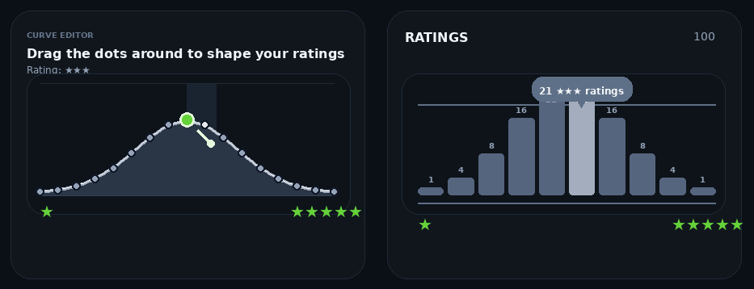

# Letterboxd Distribution Designer

Design a target Letterboxd rating curve, upload a Letterboxd CSV export, compare films head-to-head, and export updated ratings based on the resulting Elo order.

The app combines two workflows:

- A curve designer for shaping the rating distribution you want
- An adaptive Elo sorter for deciding which films belong in each rating band

Everything runs in the browser. Uploaded CSV data is parsed locally and session state is saved in local storage.

> This project is independently made and is not affiliated with Letterboxd.

## Features

- Drag curve control points to design a target ratings distribution
- Use normal, left-skewed, right-skewed, and bimodal presets
- Toggle whole-star or half-star rating bins
- Preview how the curve maps to rating quotas
- Upload Letterboxd `watched.csv`, `ratings.csv`, or `diary.csv`
- Optionally seed Elo from imported ratings when the CSV includes ratings
- Pick preferred films in head-to-head comparisons
- Prioritize comparisons near rating cut lines and under-tested films
- Track match count, coverage, and rating-boundary clarity
- Export a CSV with rank, assigned rating, Elo, matches, wins, losses, imported rating, and Letterboxd URI

## Demo



## Getting Started

### Prerequisites

- Node.js 18+
- npm

### Install

```bash
npm install
```

### Run Locally

```bash
npm run dev
```

Then open the local URL printed in your terminal.

### Build

```bash
npm run build
```

### Preview Production Build

```bash
npm run preview
```

## How To Use

1. Shape the target ratings curve with the preset buttons and draggable curve points.
2. Keep half-star ratings enabled for the classic 0.5 to 5.0 Letterboxd scale, or disable them for whole-star ratings.
3. Upload a Letterboxd CSV export.
4. Choose the film you prefer in each head-to-head pair. You can also use the left and right arrow keys.
5. Watch the assigned ratings update as Elo changes.
6. Export the updated ratings CSV when the results are stable enough for your taste.

## Supported CSV Columns

The importer looks for common Letterboxd-style columns. It is intentionally flexible about column names.

- Title: `Name`, `Title`, `Film`, or `Movie`
- Year: `Year` or `Release Year`
- Link: `Letterboxd URI`, `URI`, `URL`, or `Link`
- Watched date: `Watched Date` or `Date`
- Rating: `Rating`, `Stars`, or `Score`

Rows without a recognizable title are skipped. Duplicate films are deduped by URI when available, otherwise by title and year.

## How Ratings Are Assigned

The curve is sampled into rating-bin probabilities. Those probabilities become quotas for the current film count using largest-remainder rounding, so the assigned counts still add up to the number of imported films.

Imported films are sorted by Elo. The highest Elo films fill the highest rating quota, then the next quota, and so on down the scale.

Pair selection focuses on two kinds of comparisons:

- Boundary comparisons near the cut line between two adjacent rating bands
- Coverage comparisons for films with too few matches

That means the app does not try to perfectly sort every film from best to worst. It focuses on the comparisons most likely to change the final Letterboxd rating assignment.

## Data And Persistence

- CSV parsing happens in the browser.
- Imported films, curve settings, and match history are saved in local storage.
- Use the app's clear/reset controls, or clear site data in your browser, to remove saved state.
- Exported results are downloaded as `letterboxd-updated-ratings.csv`.

## Project Structure

```txt
letterboxd-distribution-designer/
|-- public/
|   |-- demo.gif
|   `-- favicon.svg
|-- src/
|   |-- App.jsx
|   |-- index.css
|   |-- letterboxd_elo_rating_app.jsx
|   `-- main.jsx
|-- index.html
|-- package.json
|-- postcss.config.js
|-- README.md
|-- tailwind.config.js
`-- vite.config.js
```

`src/letterboxd_elo_rating_app.jsx` is kept as a compatibility entry point and re-exports the integrated app.

## License

MIT License. See `LICENSE` for details.
